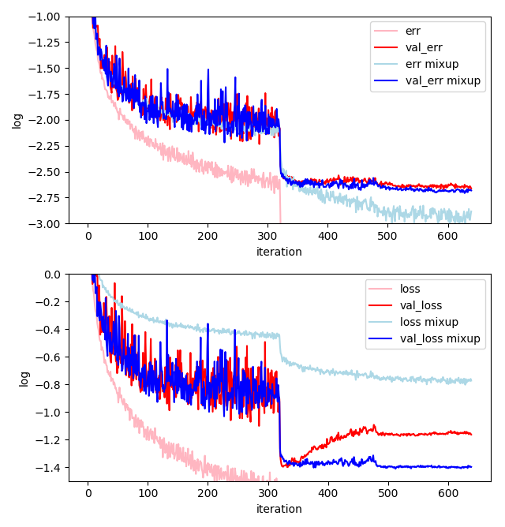
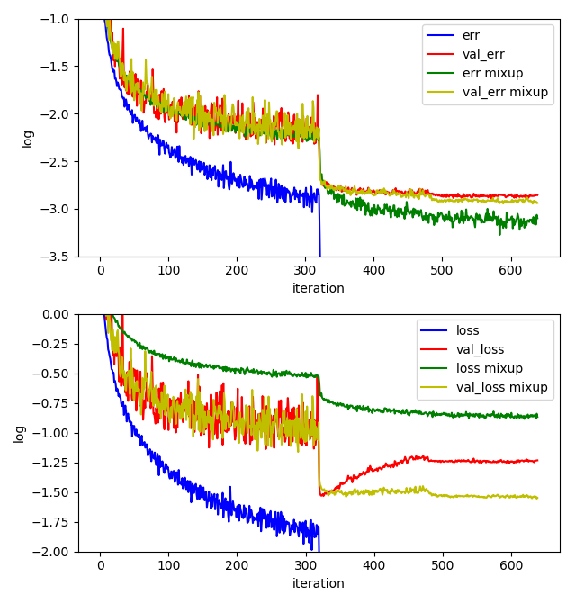

# resnet_mixup

> compare resnet 32,110 (pre-activation) with and without [mixup](https://arxiv.org/pdf/1710.09412v2.pdf)

### compare

I have trained the following four models and record the best accuracies on validation set, which are shown below (with batchsize 128):

| Layers | without mixup | with mixup |
| :----: | :-----------: | :--------: |
|   32   |    93.08%     |   93.33%   |
|  110   |    94.48%     |   94.75%   |

The loss and error on train/validation set are shown in the figures (Logarithmic coordinates):

* resnet 32 (pre-activation)

* resnet 110 (pre-activation)

### Instructions

* code in this depository is a implement of resnet 110 (pre-activation) with mixup
* there are some logs which lead to the figures above in floder `bak` , as well as some weights checkpoints

### dependency

* python 3

* pytorch 0.4.0